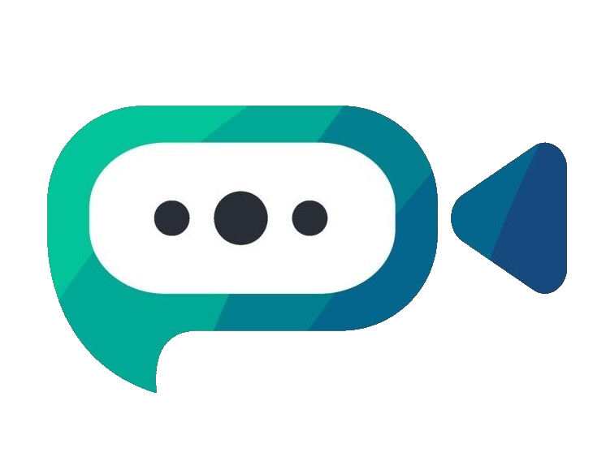

<!-- PROJECT LOGO -->

  
 
  <h1 align="center">
    <a href="https://konnect-well-engage.azurewebsites.net">
       Konnect Well
    </a>
  </h1>

  

    <strong>Group Video Calls, Chat all in one place giving you a seamless communication experience!</strong>
     
     
    <strong><a href="https://konnect-well-engage.azurewebsites.net">Visit App</a></strong>
  

<!-- TABLE OF CONTENTS -->

  
Table of Contents

  <ol>
    <li>
      <strong><a href="#about-the-project">About The Project</a></strong>
    </li>
    <li>
      <strong><a href="#deployment">Deployment</a></strong>
    </li>
    <li>
      <strong><a href="#built-with">Built With</a></strong>
    </li>
    <li>
      <strong><a href="#product-screenshots">Product Screenshots</a></strong>
    </li>
    <li>
      <strong><a href="#contact">Contact</a></strong>
    </li>
  </ol>

<!-- ABOUT THE PROJECT -->
## About The Project
<strong>
<ul>
  <li>
    Developed a video chat application as the part of Microsoft Engage Mentorship Program, this application is destined to be the approximate clone of the famous Microsoft Teams software.
  </li>
  <li>
    A user must authenticate through any of the given identity providers (Microsoft, Google, Github, LinkedIn, Amazon) inorder to use the application.
  </li>
  <li>
    Users can connect to each other through video calls which offer a wide range of capabilities like microphone mute/unmute, video mute/unmute, screen sharing, leave call, copy meeting code, ability to see the number of meeting participants and also inmeeting chat. Once a user starts a new meeting, he/she can either share the meeting link or copy the meeting code from the navigation bar to share the meeting with others. 
  </li>
  <li>
    The in-meeting chat is even persisted after the user leaves the meeting. So, if the user bychance forgets to note some things down when the meeting ends, he/she can also visit the chat section to see the respective meeting's chat.
  </li>
  <li>
    Meetings are safe, before joining an existing meeting, the user requires to take the permission of the meeting admin to enter into the meeting. The meeting admin gets a notification and accordingly can admit or deny entry. 
  </li>
  <li>
    Users also have the option to chat with any other user separately or make groups, and moreover the chat is not just a text chat but the user can send any kind of information such as bold/italic/underline text, code part, embed a link, or send attachments. 
  </li>
  <li>
    We have popups for any invalid action - for eg entering an invalid meeting code in the "Enter a code" section of videochat, which clearly conveys the information to the user.
  </li>
  <li>
    We have popups for some actions which nicely and clearly conveys the information to the user - for eg entering an invalid meeting code in the "Enter a code" section of videochat or when copying the meeting code in the videocall, or when admitting a new person, or when waiting for the admin to let you in.
  </li>
  <li>
    We also have different sounds in the app, which make the overall user experience interactive. We have sounds for waiting, permission, joining a video call, receiving a chat message as well as error.
  </li>
</ul>
</strong>

<!-- Deployment -->
## Deployment
The web app is deployed using the Microsoft Azure App Service - used CI/CD
 
[Konnect Well](https://konnect-well-engage.azurewebsites.net)

## Built With
* [WebRTC](https://webrtc.org)
* [Socket.io](https://socket.io)
* [React](https://reactjs.org)
* [Node.js](https://nodejs.org)
* [Express](https://expressjs.com)

## Product Screenshots
[![home][home]](https://github.com/PradKalkar/microsoft-teams-clone)
[![auth][auth]](https://github.com/PradKalkar/microsoft-teams-clone)
[![videochathome][videochathome]](https://github.com/PradKalkar/microsoft-teams-clone)
[![invalid][invalid]](https://github.com/PradKalkar/microsoft-teams-clone)
[![alone][alone]](https://github.com/PradKalkar/microsoft-teams-clone)
[![admitrequest][admitrequest]](https://github.com/PradKalkar/microsoft-teams-clone)
[![waiting][waiting]](https://github.com/PradKalkar/microsoft-teams-clone)
[![twopeople][twopeople]](https://github.com/PradKalkar/microsoft-teams-clone)
[![inmeetingchat][inmeetingchat]](https://github.com/PradKalkar/microsoft-teams-clone)
[![isTyping][isTyping]](https://github.com/PradKalkar/microsoft-teams-clone)
[![chatfeatures][chatfeatures]](https://github.com/PradKalkar/microsoft-teams-clone)

<!-- CONTACT -->
## Contact
Pradnesh Kalkar - ppk.kalkar@gmail.com

<!-- MARKDOWN LINKS & IMAGES -->
<!-- https://www.markdownguide.org/basic-syntax/#reference-style-links -->
[product-screenshot]: https://github.com/PradKalkar/microsoft-teams-clone/blob/master/client/public/product_images/Landing%20Page.png
[waiting]: https://github.com/PradKalkar/microsoft-teams-clone/blob/master/client/public/product_images/Waiting.png
[auth]: https://github.com/PradKalkar/microsoft-teams-clone/blob/master/client/public/product_images/Auth.png
[alone]: https://github.com/PradKalkar/microsoft-teams-clone/blob/master/client/public/product_images/Myself.png
[twopeople]: https://github.com/PradKalkar/microsoft-teams-clone/blob/master/client/public/product_images/TwoPeople.png
[inmeetingchat]: https://github.com/PradKalkar/microsoft-teams-clone/blob/master/client/public/product_images/InMeetChat.png
[isTyping]: https://github.com/PradKalkar/microsoft-teams-clone/blob/master/client/public/product_images/isTyping.png
[videochathome]: https://github.com/PradKalkar/microsoft-teams-clone/blob/master/client/public/product_images/Videochat%20Home.png
[home]: https://github.com/PradKalkar/microsoft-teams-clone/blob/master/client/public/product_images/Landing%20Page.png
[chatfeatures]: https://github.com/PradKalkar/microsoft-teams-clone/blob/master/client/public/product_images/ChatFeatures.png
[invalid]: https://github.com/PradKalkar/microsoft-teams-clone/blob/master/client/public/product_images/InvalidMeetCode.png
[admitrequest]: https://github.com/PradKalkar/microsoft-teams-clone/blob/master/client/public/product_images/AdminRequest.png
